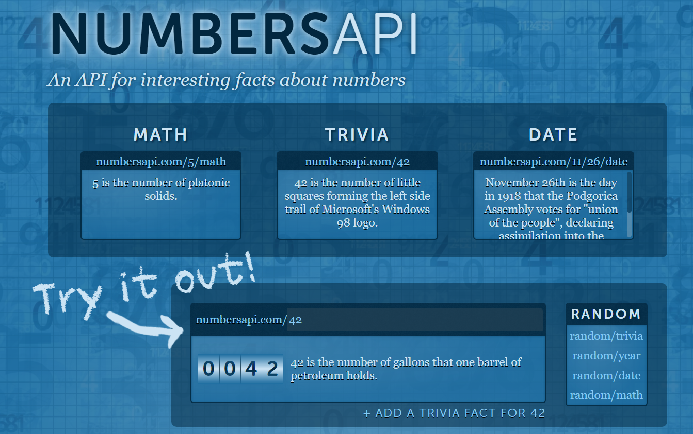

# Basic ETL
## Introduction
This repository has the function obtain data from a simple API from [Number API](http://numbersapi.com/#42). The API retune a random description of this number and load it csv file.

## Organization

The organization of this repository is as follows:

<pre>
├───src
│   ├─── extract_api.py
│   ├─── load_api.py
│   ├─── transform_api.py
│   └─── utils.py
├───data
├───logfile
├─── README.md
└─── requirements.txt
</pre>

# Installation instructions
### Create a virtualenv or conda environment
    python -m venv path\to\myenv
    conda create -n myenv python=3.7

### Clone the project repository
    git clone https://github.com/MorillaGit/Humai_class_1

#### move to the project directory
    cd Humai_class_1

### Install the requirements
    pip install -r requirements.txt

# Run the project
    python src/main.py -n 42

42 --> is a example number
### Parameters
* `--number o -n`: is the number to extract from the API. Must be a integer number between 0 and 99.

## Expected output

